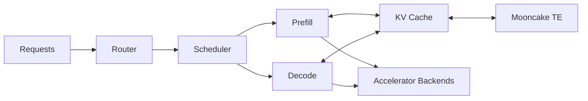

  <h1>Hi, I'm Reese.</h1>
  
<strong>I work where inference engines meet real clusters.</strong>

  
AI infrastructure · SGLang · distributed systems · performance engineering

  

    <a href="https://imreese.github.io/">Website</a> ·
    <a href="https://imreese.github.io/blogs/">Engineering notes</a> ·
    <a href="mailto:reese_duan@outlook.com">Email</a>
  

  

## 🛰️ Current coordinates

I'm a software engineer in **Baidu AI Computing's Training & Inference Engine
Team**, supporting enterprise SGLang deployment across **10k-accelerator
clusters**.

- 🚀 **Scale** — production inference serving across large accelerator fleets
- ⚙️ **Runtime** — scheduling, batching, prefill/decode, and backend execution
- 🧠 **Memory** — prefix cache, KV cache, residency, and memory hierarchy
- 🔄 **Transfer** — PD disaggregation, KV movement, and Mooncake TransferEngine
- 🔎 **Reliability** — profiling, observability, fault diagnosis, and validation

 

## 🗺️ Systems map

The part I enjoy most is where these boxes stop behaving like separate
subsystems: a scheduling decision changes cache residency, data movement shifts
the latency profile, and backend details surface all the way up the request
path.

## 🧩 Selected systems

| Project | What it explores |
| --- | --- |
| [**sglang-rs**](https://github.com/imReese/sglang-rs) | A Rust runtime covering request lifecycle, gRPC routing, scheduling, prefix caching, KV page allocation, and PD KV-transfer boundaries. |
| [**NexusKV**](https://github.com/imReese/NexusKV) | A KV cache platform separating control plane, data plane, state/index, and engine adapters across Go, Rust, and Python. |
| [**imreese.github.io**](https://github.com/imReese/imReese.github.io) | My personal site and source-level engineering notes, built with Next.js and MDX. |

## ✍️ Recent field notes

- [SGLang v0.5.14 to Mooncake Store: page key, zero-copy, and shared TE](https://imreese.github.io/blogs/sglang-to-mooncake-store-kv-cache-path/)
- [SGLang HiCache read path: prefetch, load back, and scheduling boundaries](https://imreese.github.io/blogs/sglang-hicache-read-path/)
- [SGLang HiCache write path: moving GPU KV to Host and Storage](https://imreese.github.io/blogs/sglang-hicache-write-path/)
- [Mooncake Transfer Engine transport layer: TCP, RDMA, and device paths](https://imreese.github.io/blogs/mooncake-transfer-engine-transport-layer/)

## 🧰 Toolbox

  <picture>
    <source
      media="(prefers-color-scheme: dark)"
      srcset="https://skillicons.dev/icons?i=rust,cpp,go,python,linux,docker,kubernetes,git&amp;theme=dark"
    />
    <source
      media="(prefers-color-scheme: light)"
      srcset="https://skillicons.dev/icons?i=rust,cpp,go,python,linux,docker,kubernetes,git&amp;theme=light"
    />
    
  </picture>

  SGLang · KV Cache · Mooncake TE · gRPC · perf · tracing · benchmarking

  
<strong>Earlier systems work</strong>

   
  Before Baidu, I worked on cloud workload characterization and CPU
  architecture at Huawei Cloud's Shuhai Lab, and on distributed-storage
  control-plane systems at Huawei Data Storage.

## 🐍 Contributions

<picture>
  <source
    media="(prefers-color-scheme: dark)"
    srcset="https://raw.githubusercontent.com/imReese/imReese/output/github-snake-dark.svg"
  />
  <source
    media="(prefers-color-scheme: light)"
    srcset="https://raw.githubusercontent.com/imReese/imReese/output/github-snake.svg"
  />
  
</picture>

  Beijing, China · building systems that stay understandable under load

